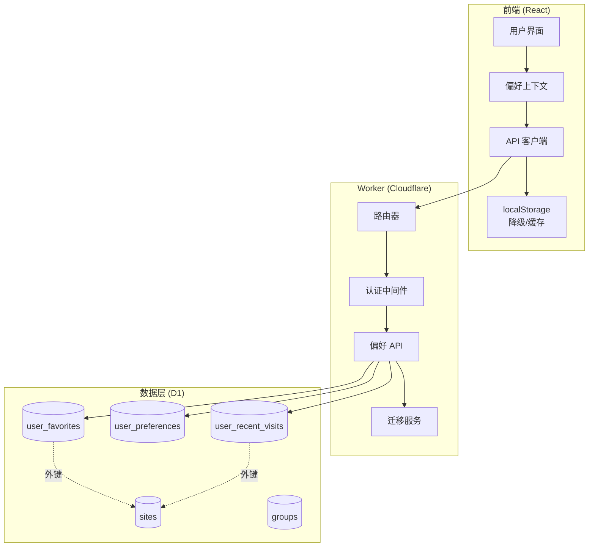

# 设计文档 - 用户偏好持久化

## 概述

本设计文档描述了将用户偏好从 localStorage 迁移到 D1 数据库的技术实现方案。该功能将实现跨设备同步、持久化存储，并支持游客用户的偏好管理。

### 目标

- 将收藏站点、用户偏好设置从 localStorage 迁移到 D1 数据库
- 支持已认证用户和游客用户的偏好管理
- 实现跨设备同步功能
- 提供平滑的数据迁移路径
- 保持向后兼容性和降级能力

### 范围

**包含:**
- 新增三个数据库表：user_favorites、user_preferences、user_recent_visits
- 新增 RESTful API 端点用于偏好管理
- 前端从 localStorage 迁移到 API 调用
- 游客用户设备标识符生成和管理
- localStorage 到数据库的一次性迁移服务
- 错误处理和降级机制

**不包含:**
- 用户账户系统的修改（使用现有认证机制）
- 跨浏览器的游客用户同步（游客用户仅限单设备）
- 实时同步功能（使用轮询或手动刷新）

## 架构

### 系统架构图



### 数据流

#### 已认证用户流程
1. 用户登录 → 获取认证令牌（HttpOnly Cookie）
2. 前端请求偏好数据 → Worker 验证令牌 → 从 D1 查询用户偏好
3. 用户修改偏好 → 前端调用 API → Worker 更新 D1 → 返回成功响应
4. 前端更新本地缓存

#### 游客用户流程
1. 首次访问 → 生成 device_identifier → 存储到 localStorage
2. 游客添加收藏 → 使用 device_identifier 作为 user_id → 保存到 D1
3. 游客登录 → 调用迁移 API → 将 device_identifier 数据迁移到用户账户
4. 清理临时数据

#### 降级流程
1. API 请求失败 → 检查 localStorage 缓存
2. 使用缓存数据继续运行
3. 后台重试同步
4. 网络恢复后批量同步更改

## 组件和接口

### 数据库架构

#### user_favorites 表

```sql
CREATE TABLE IF NOT EXISTS user_favorites (
    id INTEGER PRIMARY KEY AUTOINCREMENT,
    user_id TEXT NOT NULL,  -- 已认证用户的用户名或游客的 device_identifier
    site_id INTEGER NOT NULL,
    created_at TIMESTAMP DEFAULT CURRENT_TIMESTAMP,
    FOREIGN KEY (site_id) REFERENCES sites(id) ON DELETE CASCADE,
    UNIQUE(user_id, site_id)  -- 防止重复收藏
);

CREATE INDEX idx_user_favorites_user_id ON user_favorites(user_id);
CREATE INDEX idx_user_favorites_site_id ON user_favorites(site_id);
```

**字段说明:**
- `id`: 主键，自增
- `user_id`: 用户标识符（已认证用户为用户名，游客为 device_identifier）
- `site_id`: 站点 ID，外键关联 sites 表
- `created_at`: 创建时间戳
- 唯一约束确保同一用户不能重复收藏同一站点

#### user_preferences 表

```sql
CREATE TABLE IF NOT EXISTS user_preferences (
    user_id TEXT PRIMARY KEY,  -- 用户标识符
    view_mode TEXT DEFAULT 'card',  -- 'card' | 'list'
    theme_mode TEXT DEFAULT 'light',  -- 'light' | 'dark'
    custom_colors TEXT,  -- JSON 字符串存储自定义颜色
    updated_at TIMESTAMP DEFAULT CURRENT_TIMESTAMP
);
```

**字段说明:**
- `user_id`: 主键，用户标识符
- `view_mode`: 视图模式（卡片或列表）
- `theme_mode`: 主题模式（亮色或暗色）
- `custom_colors`: 自定义颜色配置（JSON 格式）
- `updated_at`: 最后更新时间戳

#### user_recent_visits 表

```sql
CREATE TABLE IF NOT EXISTS user_recent_visits (
    id INTEGER PRIMARY KEY AUTOINCREMENT,
    user_id TEXT NOT NULL,
    site_id INTEGER NOT NULL,
    visited_at TIMESTAMP DEFAULT CURRENT_TIMESTAMP,
    FOREIGN KEY (site_id) REFERENCES sites(id) ON DELETE CASCADE
);

CREATE INDEX idx_user_recent_visits_user_id ON user_recent_visits(user_id);
CREATE INDEX idx_user_recent_visits_visited_at ON user_recent_visits(visited_at DESC);
CREATE UNIQUE INDEX idx_user_recent_visits_unique ON user_recent_visits(user_id, site_id);
```

**字段说明:**
- `id`: 主键，自增
- `user_id`: 用户标识符
- `site_id`: 站点 ID，外键关联 sites 表
- `visited_at`: 访问时间戳
- 唯一索引确保同一用户对同一站点只保留最新访问记录

**访问记录管理策略:**
- 使用 `INSERT OR REPLACE` 更新访问时间
- 通过触发器或定期清理保持每用户最多 20 条记录

### API 端点规范

#### 1. 获取收藏列表

```
GET /api/preferences/favorites
```

**认证:** 可选（已认证用户使用 user_id，游客使用 device_identifier）

**请求头:**
```
Cookie: auth_token=<token>  (已认证用户)
X-Device-ID: <device_identifier>  (游客用户)
```

**响应:**
```json
{
  "success": true,
  "favorites": [
    {
      "id": 1,
      "site_id": 42,
      "created_at": "2024-01-15T10:30:00Z"
    }
  ]
}
```

**错误响应:**
```json
{
  "success": false,
  "message": "获取收藏列表失败",
  "errorId": "uuid"
}
```

#### 2. 添加收藏

```
POST /api/preferences/favorites/:siteId
```

**认证:** 可选

**请求参数:**
- `siteId`: 站点 ID（URL 路径参数）

**响应:**
```json
{
  "success": true,
  "message": "收藏成功",
  "favorite": {
    "id": 1,
    "site_id": 42,
    "created_at": "2024-01-15T10:30:00Z"
  }
}
```

**错误响应:**
```json
{
  "success": false,
  "message": "该站点已在收藏列表中"
}
```

#### 3. 删除收藏

```
DELETE /api/preferences/favorites/:siteId
```

**认证:** 可选

**请求参数:**
- `siteId`: 站点 ID（URL 路径参数）

**响应:**
```json
{
  "success": true,
  "message": "取消收藏成功"
}
```

#### 4. 获取用户偏好设置

```
GET /api/preferences/settings
```

**认证:** 可选

**响应:**
```json
{
  "success": true,
  "preferences": {
    "view_mode": "card",
    "theme_mode": "dark",
    "custom_colors": {
      "primary": "#5eead4",
      "secondary": "#fb923c",
      "background": "#07131d",
      "surface": "rgba(10, 23, 33, 0.82)",
      "text": "#f4fbfa"
    },
    "updated_at": "2024-01-15T10:30:00Z"
  }
}
```

#### 5. 更新用户偏好设置

```
PUT /api/preferences/settings
```

**认证:** 可选

**请求体:**
```json
{
  "view_mode": "list",
  "theme_mode": "light",
  "custom_colors": null
}
```

**响应:**
```json
{
  "success": true,
  "message": "偏好设置已更新"
}
```

#### 6. 记录站点访问

```
POST /api/preferences/visits/:siteId
```

**认证:** 可选

**请求参数:**
- `siteId`: 站点 ID（URL 路径参数）

**响应:**
```json
{
  "success": true,
  "message": "访问记录已保存"
}
```

#### 7. 获取最近访问

```
GET /api/preferences/visits
```

**认证:** 可选

**查询参数:**
- `limit`: 返回记录数量（默认 20，最大 50）

**响应:**
```json
{
  "success": true,
  "visits": [
    {
      "id": 1,
      "site_id": 42,
      "visited_at": "2024-01-15T10:30:00Z"
    }
  ]
}
```

#### 8. 迁移游客偏好

```
POST /api/preferences/migrate
```

**认证:** 必需（已登录用户）

**请求体:**
```json
{
  "device_identifier": "guest_abc123def456"
}
```

**响应:**
```json
{
  "success": true,
  "message": "偏好数据迁移成功",
  "migrated": {
    "favorites": 5,
    "visits": 12
  }
}
```

### 前端架构变更

#### 新增：PreferencesContext

```typescript
// src/contexts/PreferencesContext.tsx

interface PreferencesContextValue {
  // 收藏管理
  favorites: number[];
  isFavorite: (siteId: number) => boolean;
  toggleFavorite: (siteId: number) => Promise<void>;
  
  // 最近访问
  recentVisits: number[];
  recordVisit: (siteId: number) => Promise<void>;
  
  // 加载状态
  isLoading: boolean;
  error: string | null;
  
  // 迁移状态
  migrationStatus: 'pending' | 'in-progress' | 'completed' | 'failed';
  triggerMigration: () => Promise<void>;
}
```

#### 修改：ThemeContext

将主题偏好同步到数据库：

```typescript
// src/contexts/ThemeContext.tsx

// 新增：同步到服务器
const syncToServer = async (preferences: ThemePreferences) => {
  try {
    await apiClient.updatePreferences({
      theme_mode: preferences.mode,
      custom_colors: preferences.customColors 
        ? JSON.stringify(preferences.customColors) 
        : null
    });
  } catch (error) {
    console.error('Failed to sync theme preferences:', error);
    // 降级：继续使用 localStorage
  }
};
```

#### 修改：NavigationClient

```typescript
// src/API/client.ts

export class NavigationClient {
  // 新增：偏好管理方法
  
  async getFavorites(): Promise<number[]> {
    const response = await this.request('preferences/favorites');
    return response.favorites.map((f: any) => f.site_id);
  }
  
  async addFavorite(siteId: number): Promise<void> {
    await this.request(`preferences/favorites/${siteId}`, {
      method: 'POST'
    });
  }
  
  async removeFavorite(siteId: number): Promise<void> {
    await this.request(`preferences/favorites/${siteId}`, {
      method: 'DELETE'
    });
  }
  
  async getPreferences(): Promise<UserPreferences> {
    const response = await this.request('preferences/settings');
    return response.preferences;
  }
  
  async updatePreferences(prefs: Partial<UserPreferences>): Promise<void> {
    await this.request('preferences/settings', {
      method: 'PUT',
      body: JSON.stringify(prefs)
    });
  }
  
  async recordVisit(siteId: number): Promise<void> {
    await this.request(`preferences/visits/${siteId}`, {
      method: 'POST'
    });
  }
  
  async getRecentVisits(limit: number = 20): Promise<number[]> {
    const response = await this.request(`preferences/visits?limit=${limit}`);
    return response.visits.map((v: any) => v.site_id);
  }
  
  async migrateGuestPreferences(deviceId: string): Promise<MigrationResult> {
    return this.request('preferences/migrate', {
      method: 'POST',
      body: JSON.stringify({ device_identifier: deviceId })
    });
  }
}
```

### Worker 实现

#### 设备标识符管理

```typescript
// worker/utils/deviceIdentifier.ts

export function getDeviceIdentifier(request: Request): string | null {
  // 优先从请求头获取
  const headerDeviceId = request.headers.get('X-Device-ID');
  if (headerDeviceId) {
    return headerDeviceId;
  }
  
  // 从 Cookie 获取
  const cookieHeader = request.headers.get('Cookie');
  if (cookieHeader) {
    const cookies = parseCookies(cookieHeader);
    return cookies['device_id'] || null;
  }
  
  return null;
}

export function generateDeviceIdentifier(): string {
  return `guest_${crypto.randomUUID()}`;
}
```

#### 用户标识符解析

```typescript
// worker/utils/userIdentifier.ts

export async function getUserIdentifier(
  request: Request,
  api: NavigationAPI
): Promise<{ userId: string; isGuest: boolean }> {
  // 1. 尝试获取已认证用户
  const token = getAuthToken(request);
  if (token) {
    try {
      const verifyResult = await api.verifyToken(token);
      if (verifyResult.valid && verifyResult.username) {
        return {
          userId: verifyResult.username,
          isGuest: false
        };
      }
    } catch (error) {
      console.error('Token verification failed:', error);
    }
  }
  
  // 2. 获取或生成游客标识符
  let deviceId = getDeviceIdentifier(request);
  if (!deviceId) {
    deviceId = generateDeviceIdentifier();
  }
  
  return {
    userId: deviceId,
    isGuest: true
  };
}
```

#### 偏好 API 实现

```typescript
// worker/api/preferences.ts

export class PreferencesAPI {
  constructor(private db: D1Database) {}
  
  async getFavorites(userId: string): Promise<Favorite[]> {
    const result = await this.db
      .prepare('SELECT * FROM user_favorites WHERE user_id = ? ORDER BY created_at DESC')
      .bind(userId)
      .all();
    
    return result.results as Favorite[];
  }
  
  async addFavorite(userId: string, siteId: number): Promise<Favorite> {
    // 检查站点是否存在
    const site = await this.db
      .prepare('SELECT id FROM sites WHERE id = ?')
      .bind(siteId)
      .first();
    
    if (!site) {
      throw new Error('站点不存在');
    }
    
    // 插入收藏（如果已存在则忽略）
    const result = await this.db
      .prepare(`
        INSERT INTO user_favorites (user_id, site_id)
        VALUES (?, ?)
        ON CONFLICT(user_id, site_id) DO NOTHING
        RETURNING *
      `)
      .bind(userId, siteId)
      .first();
    
    if (!result) {
      throw new Error('该站点已在收藏列表中');
    }
    
    return result as Favorite;
  }
  
  async removeFavorite(userId: string, siteId: number): Promise<boolean> {
    const result = await this.db
      .prepare('DELETE FROM user_favorites WHERE user_id = ? AND site_id = ?')
      .bind(userId, siteId)
      .run();
    
    return result.success;
  }
  
  async getPreferences(userId: string): Promise<UserPreferences | null> {
    const result = await this.db
      .prepare('SELECT * FROM user_preferences WHERE user_id = ?')
      .bind(userId)
      .first();
    
    if (!result) {
      return null;
    }
    
    const prefs = result as any;
    
    // 解析 JSON 字段
    if (prefs.custom_colors) {
      try {
        prefs.custom_colors = JSON.parse(prefs.custom_colors);
      } catch {
        prefs.custom_colors = null;
      }
    }
    
    return prefs;
  }
  
  async updatePreferences(
    userId: string,
    prefs: Partial<UserPreferences>
  ): Promise<void> {
    const updates: string[] = [];
    const values: any[] = [];
    
    if (prefs.view_mode !== undefined) {
      updates.push('view_mode = ?');
      values.push(prefs.view_mode);
    }
    
    if (prefs.theme_mode !== undefined) {
      updates.push('theme_mode = ?');
      values.push(prefs.theme_mode);
    }
    
    if (prefs.custom_colors !== undefined) {
      updates.push('custom_colors = ?');
      values.push(prefs.custom_colors ? JSON.stringify(prefs.custom_colors) : null);
    }
    
    updates.push('updated_at = CURRENT_TIMESTAMP');
    values.push(userId);
    
    await this.db
      .prepare(`
        INSERT INTO user_preferences (user_id, ${updates.map((_, i) => 
          updates[i].split(' = ')[0]).join(', ')})
        VALUES (?, ${updates.map(() => '?').join(', ')})
        ON CONFLICT(user_id) DO UPDATE SET ${updates.join(', ')}
      `)
      .bind(...values, userId)
      .run();
  }
  
  async recordVisit(userId: string, siteId: number): Promise<void> {
    // 使用 INSERT OR REPLACE 更新访问时间
    await this.db
      .prepare(`
        INSERT INTO user_recent_visits (user_id, site_id, visited_at)
        VALUES (?, ?, CURRENT_TIMESTAMP)
        ON CONFLICT(user_id, site_id) DO UPDATE SET visited_at = CURRENT_TIMESTAMP
      `)
      .bind(userId, siteId)
      .run();
    
    // 清理旧记录，保留最近 20 条
    await this.db
      .prepare(`
        DELETE FROM user_recent_visits
        WHERE user_id = ?
        AND id NOT IN (
          SELECT id FROM user_recent_visits
          WHERE user_id = ?
          ORDER BY visited_at DESC
          LIMIT 20
        )
      `)
      .bind(userId, userId)
      .run();
  }
  
  async getRecentVisits(userId: string, limit: number = 20): Promise<Visit[]> {
    const result = await this.db
      .prepare(`
        SELECT * FROM user_recent_visits
        WHERE user_id = ?
        ORDER BY visited_at DESC
        LIMIT ?
      `)
      .bind(userId, Math.min(limit, 50))
      .all();
    
    return result.results as Visit[];
  }
  
  async migrateGuestData(
    guestUserId: string,
    authenticatedUserId: string
  ): Promise<MigrationResult> {
    const migrated = {
      favorites: 0,
      visits: 0
    };
    
    try {
      // 开始事务（D1 不直接支持事务，使用批处理）
      const statements: D1PreparedStatement[] = [];
      
      // 1. 迁移收藏（处理重复）
      statements.push(
        this.db.prepare(`
          INSERT INTO user_favorites (user_id, site_id, created_at)
          SELECT ?, site_id, created_at
          FROM user_favorites
          WHERE user_id = ?
          ON CONFLICT(user_id, site_id) DO NOTHING
        `).bind(authenticatedUserId, guestUserId)
      );
      
      // 2. 迁移访问记录
      statements.push(
        this.db.prepare(`
          INSERT INTO user_recent_visits (user_id, site_id, visited_at)
          SELECT ?, site_id, visited_at
          FROM user_recent_visits
          WHERE user_id = ?
          ON CONFLICT(user_id, site_id) DO UPDATE SET
            visited_at = MAX(visited_at, excluded.visited_at)
        `).bind(authenticatedUserId, guestUserId)
      );
      
      // 3. 删除游客数据
      statements.push(
        this.db.prepare('DELETE FROM user_favorites WHERE user_id = ?')
          .bind(guestUserId)
      );
      
      statements.push(
        this.db.prepare('DELETE FROM user_recent_visits WHERE user_id = ?')
          .bind(guestUserId)
      );
      
      // 执行批处理
      const results = await this.db.batch(statements);
      
      // 统计迁移数量
      migrated.favorites = results[0].meta?.changes || 0;
      migrated.visits = results[1].meta?.changes || 0;
      
      return migrated;
    } catch (error) {
      console.error('Migration failed:', error);
      throw new Error('偏好数据迁移失败');
    }
  }
}
```

## 数据模型

### TypeScript 类型定义

```typescript
// src/types/preferences.ts

export interface Favorite {
  id: number;
  user_id: string;
  site_id: number;
  created_at: string;
}

export interface UserPreferences {
  user_id: string;
  view_mode: 'card' | 'list';
  theme_mode: 'light' | 'dark';
  custom_colors: CustomThemeColors | null;
  updated_at: string;
}

export interface CustomThemeColors {
  primary: string;
  secondary: string;
  background: string;
  surface: string;
  text: string;
}

export interface Visit {
  id: number;
  user_id: string;
  site_id: number;
  visited_at: string;
}

export interface MigrationResult {
  favorites: number;
  visits: number;
}

export interface PreferencesCache {
  favorites: number[];
  recentVisits: number[];
  settings: UserPreferences | null;
  lastSync: number;
}
```

### localStorage 数据结构（向后兼容）

```typescript
// 收藏站点 ID 列表
// Key: 'navihive.favoriteSiteIds'
type FavoriteSiteIds = number[];

// 最近访问站点 ID 列表
// Key: 'navihive.recentSiteIds'
type RecentSiteIds = number[];

// 主题偏好
// Key: 'navihive.themePreferences'
interface ThemePreferences {
  mode: 'light' | 'dark';
  customColors: CustomThemeColors | null;
  lastUpdated: number;
}

// 视图模式
// Key: 'navihive.viewMode'
type ViewMode = 'card' | 'list';

// 迁移状态标记
// Key: 'navihive.migrationCompleted'
interface MigrationStatus {
  completed: boolean;
  timestamp: number;
  version: string;
}
```


## 迁移策略

### 迁移服务实现

#### 前端迁移服务

```typescript
// src/services/MigrationService.ts

export class MigrationService {
  private static readonly MIGRATION_KEY = 'navihive.migrationCompleted';
  private static readonly VERSION = '1.0.0';
  
  constructor(private apiClient: NavigationClient) {}
  
  /**
   * 检查是否需要迁移
   */
  needsMigration(): boolean {
    const status = getLocalStorageItem<MigrationStatus | null>(
      MigrationService.MIGRATION_KEY,
      null
    );
    
    return !status || !status.completed || status.version !== MigrationService.VERSION;
  }
  
  /**
   * 执行迁移
   */
  async migrate(): Promise<MigrationResult> {
    try {
      // 1. 读取 localStorage 数据
      const favoriteSiteIds = getLocalStorageItem<number[]>(
        'navihive.favoriteSiteIds',
        []
      );
      
      const recentSiteIds = getLocalStorageItem<number[]>(
        'navihive.recentSiteIds',
        []
      );
      
      const themePrefs = getLocalStorageItem<ThemePreferences>(
        'navihive.themePreferences',
        { mode: 'light', customColors: null, lastUpdated: Date.now() }
      );
      
      const viewMode = getLocalStorageItem<ViewMode>(
        'navihive.viewMode',
        'card'
      );
      
      // 2. 批量上传到服务器
      const results = {
        favorites: 0,
        visits: 0,
        settings: false
      };
      
      // 迁移收藏
      for (const siteId of favoriteSiteIds) {
        try {
          await this.apiClient.addFavorite(siteId);
          results.favorites++;
        } catch (error) {
          console.warn(`Failed to migrate favorite ${siteId}:`, error);
        }
      }
      
      // 迁移访问记录
      for (const siteId of recentSiteIds) {
        try {
          await this.apiClient.recordVisit(siteId);
          results.visits++;
        } catch (error) {
          console.warn(`Failed to migrate visit ${siteId}:`, error);
        }
      }
      
      // 迁移偏好设置
      try {
        await this.apiClient.updatePreferences({
          view_mode: viewMode,
          theme_mode: themePrefs.mode,
          custom_colors: themePrefs.customColors 
            ? JSON.stringify(themePrefs.customColors) 
            : null
        });
        results.settings = true;
      } catch (error) {
        console.warn('Failed to migrate preferences:', error);
      }
      
      // 3. 标记迁移完成
      setLocalStorageItem(MigrationService.MIGRATION_KEY, {
        completed: true,
        timestamp: Date.now(),
        version: MigrationService.VERSION
      });
      
      return results;
    } catch (error) {
      console.error('Migration failed:', error);
      throw error;
    }
  }
  
  /**
   * 显示迁移 UI 提示
   */
  async showMigrationPrompt(): Promise<boolean> {
    return new Promise((resolve) => {
      // 使用 Material-UI Dialog 或自定义提示
      const userConfirmed = window.confirm(
        '检测到本地数据，是否迁移到云端以实现跨设备同步？'
      );
      resolve(userConfirmed);
    });
  }
}
```

#### 自动迁移流程

```typescript
// src/App.tsx

function App() {
  const [migrationStatus, setMigrationStatus] = useState<
    'idle' | 'checking' | 'migrating' | 'completed' | 'failed'
  >('idle');
  
  useEffect(() => {
    const checkAndMigrate = async () => {
      const migrationService = new MigrationService(apiClient);
      
      if (!migrationService.needsMigration()) {
        setMigrationStatus('completed');
        return;
      }
      
      setMigrationStatus('checking');
      
      // 询问用户是否迁移
      const shouldMigrate = await migrationService.showMigrationPrompt();
      
      if (!shouldMigrate) {
        setMigrationStatus('idle');
        return;
      }
      
      setMigrationStatus('migrating');
      
      try {
        const result = await migrationService.migrate();
        console.log('Migration completed:', result);
        setMigrationStatus('completed');
      } catch (error) {
        console.error('Migration failed:', error);
        setMigrationStatus('failed');
      }
    };
    
    // 仅在已登录时执行迁移
    if (apiClient.isAuthenticated) {
      checkAndMigrate();
    }
  }, [apiClient.isAuthenticated]);
  
  // ... rest of component
}
```

### 游客用户登录后迁移

```typescript
// src/components/LoginForm.tsx

const handleLogin = async (username: string, password: string) => {
  try {
    // 1. 获取当前游客设备 ID
    const deviceId = getLocalStorageItem<string>('navihive.deviceId', '');
    
    // 2. 执行登录
    const result = await apiClient.login(username, password);
    
    if (result.success) {
      // 3. 如果有游客数据，触发迁移
      if (deviceId) {
        try {
          const migrationResult = await apiClient.migrateGuestPreferences(deviceId);
          console.log('Guest data migrated:', migrationResult);
          
          // 清除游客设备 ID
          removeLocalStorageItem('navihive.deviceId');
        } catch (error) {
          console.error('Failed to migrate guest data:', error);
          // 不阻止登录流程
        }
      }
      
      // 4. 执行 localStorage 迁移
      const migrationService = new MigrationService(apiClient);
      if (migrationService.needsMigration()) {
        await migrationService.migrate();
      }
    }
  } catch (error) {
    console.error('Login failed:', error);
  }
};
```

## 错误处理

### 错误类型和处理策略

#### 1. 网络错误

**场景:** API 请求失败（网络断开、服务器不可用）

**处理策略:**
- 使用 localStorage 缓存数据继续运行
- 显示离线提示
- 后台自动重试（指数退避）
- 网络恢复后批量同步

```typescript
// src/services/PreferencesService.ts

export class PreferencesService {
  private retryQueue: Array<() => Promise<void>> = [];
  private isOnline: boolean = navigator.onLine;
  
  constructor(private apiClient: NavigationClient) {
    // 监听网络状态
    window.addEventListener('online', () => this.handleOnline());
    window.addEventListener('offline', () => this.handleOffline());
  }
  
  async toggleFavorite(siteId: number): Promise<void> {
    // 1. 立即更新本地缓存
    const currentFavorites = this.getCachedFavorites();
    const isFavorite = currentFavorites.includes(siteId);
    
    const newFavorites = isFavorite
      ? currentFavorites.filter(id => id !== siteId)
      : [...currentFavorites, siteId];
    
    this.setCachedFavorites(newFavorites);
    
    // 2. 尝试同步到服务器
    try {
      if (isFavorite) {
        await this.apiClient.removeFavorite(siteId);
      } else {
        await this.apiClient.addFavorite(siteId);
      }
    } catch (error) {
      console.error('Failed to sync favorite:', error);
      
      // 3. 添加到重试队列
      this.retryQueue.push(async () => {
        if (isFavorite) {
          await this.apiClient.removeFavorite(siteId);
        } else {
          await this.apiClient.addFavorite(siteId);
        }
      });
    }
  }
  
  private async handleOnline(): Promise<void> {
    this.isOnline = true;
    console.log('Network restored, syncing queued operations...');
    
    // 执行重试队列
    while (this.retryQueue.length > 0) {
      const operation = this.retryQueue.shift();
      if (operation) {
        try {
          await operation();
        } catch (error) {
          console.error('Retry failed:', error);
          // 重新加入队列
          this.retryQueue.push(operation);
          break;
        }
      }
    }
  }
  
  private handleOffline(): void {
    this.isOnline = false;
    console.log('Network offline, using cached data');
  }
}
```

#### 2. 数据冲突

**场景:** 多设备同时修改同一偏好

**处理策略:**
- 使用"最后写入获胜"（Last Write Wins）策略
- 通过 `updated_at` 时间戳判断
- 前端定期轮询更新

```typescript
// Worker 端冲突解决
async updatePreferences(
  userId: string,
  prefs: Partial<UserPreferences>
): Promise<void> {
  // 使用 updated_at 确保最新数据
  const query = `
    INSERT INTO user_preferences (user_id, view_mode, theme_mode, custom_colors, updated_at)
    VALUES (?, ?, ?, ?, CURRENT_TIMESTAMP)
    ON CONFLICT(user_id) DO UPDATE SET
      view_mode = CASE 
        WHEN excluded.updated_at > user_preferences.updated_at 
        THEN excluded.view_mode 
        ELSE user_preferences.view_mode 
      END,
      theme_mode = CASE 
        WHEN excluded.updated_at > user_preferences.updated_at 
        THEN excluded.theme_mode 
        ELSE user_preferences.theme_mode 
      END,
      custom_colors = CASE 
        WHEN excluded.updated_at > user_preferences.updated_at 
        THEN excluded.custom_colors 
        ELSE user_preferences.custom_colors 
      END,
      updated_at = CURRENT_TIMESTAMP
  `;
  
  await this.db.prepare(query).bind(
    userId,
    prefs.view_mode,
    prefs.theme_mode,
    prefs.custom_colors
  ).run();
}
```

#### 3. 数据库错误

**场景:** D1 数据库操作失败

**处理策略:**
- 返回明确的错误信息和 HTTP 状态码
- 记录详细错误日志
- 前端降级到 localStorage

```typescript
// worker/index.ts

try {
  const favorites = await prefsAPI.getFavorites(userId);
  return createJsonResponse({ success: true, favorites }, request);
} catch (error) {
  log({
    level: 'error',
    message: 'Failed to get favorites',
    errorId: generateErrorId(),
    path: request.url,
    details: error
  });
  
  return createJsonResponse(
    {
      success: false,
      message: '获取收藏列表失败，请稍后重试',
      errorId: generateErrorId()
    },
    request,
    { status: 500 }
  );
}
```

#### 4. 迁移失败

**场景:** localStorage 到数据库迁移失败

**处理策略:**
- 保留 localStorage 数据不变
- 记录错误日志
- 允许用户手动重试
- 提供跳过选项

```typescript
// src/services/MigrationService.ts

async migrate(): Promise<MigrationResult> {
  try {
    // 迁移逻辑...
    
    // 成功后才清理 localStorage
    setLocalStorageItem(MigrationService.MIGRATION_KEY, {
      completed: true,
      timestamp: Date.now(),
      version: MigrationService.VERSION
    });
    
    return results;
  } catch (error) {
    // 失败时保留 localStorage 数据
    console.error('Migration failed, localStorage data preserved:', error);
    
    // 记录失败状态
    setLocalStorageItem(MigrationService.MIGRATION_KEY, {
      completed: false,
      timestamp: Date.now(),
      version: MigrationService.VERSION,
      error: error instanceof Error ? error.message : 'Unknown error'
    });
    
    throw error;
  }
}
```

### 错误响应格式

所有 API 错误响应遵循统一格式：

```typescript
interface ErrorResponse {
  success: false;
  message: string;  // 用户友好的错误信息
  errorId?: string;  // 用于日志追踪的唯一 ID
  details?: unknown;  // 开发环境下的详细信息
}
```

## 测试策略

### 单元测试

#### 前端测试

```typescript
// src/services/__tests__/MigrationService.test.ts

describe('MigrationService', () => {
  it('should detect migration need when no status exists', () => {
    const service = new MigrationService(mockApiClient);
    expect(service.needsMigration()).toBe(true);
  });
  
  it('should migrate favorites from localStorage to API', async () => {
    localStorage.setItem('navihive.favoriteSiteIds', JSON.stringify([1, 2, 3]));
    
    const service = new MigrationService(mockApiClient);
    const result = await service.migrate();
    
    expect(result.favorites).toBe(3);
    expect(mockApiClient.addFavorite).toHaveBeenCalledTimes(3);
  });
  
  it('should preserve localStorage data on migration failure', async () => {
    localStorage.setItem('navihive.favoriteSiteIds', JSON.stringify([1, 2, 3]));
    mockApiClient.addFavorite.mockRejectedValue(new Error('Network error'));
    
    const service = new MigrationService(mockApiClient);
    
    await expect(service.migrate()).rejects.toThrow();
    
    // localStorage 数据应该保留
    const stored = JSON.parse(localStorage.getItem('navihive.favoriteSiteIds')!);
    expect(stored).toEqual([1, 2, 3]);
  });
});
```

#### Worker 测试

```typescript
// worker/__tests__/PreferencesAPI.test.ts

describe('PreferencesAPI', () => {
  it('should add favorite and prevent duplicates', async () => {
    const api = new PreferencesAPI(mockDB);
    
    await api.addFavorite('user1', 42);
    
    // 尝试重复添加
    await expect(api.addFavorite('user1', 42))
      .rejects.toThrow('该站点已在收藏列表中');
  });
  
  it('should migrate guest data to authenticated user', async () => {
    // 准备游客数据
    await api.addFavorite('guest_abc123', 1);
    await api.addFavorite('guest_abc123', 2);
    
    // 执行迁移
    const result = await api.migrateGuestData('guest_abc123', 'user1');
    
    expect(result.favorites).toBe(2);
    
    // 验证游客数据已删除
    const guestFavorites = await api.getFavorites('guest_abc123');
    expect(guestFavorites).toHaveLength(0);
    
    // 验证用户数据已创建
    const userFavorites = await api.getFavorites('user1');
    expect(userFavorites).toHaveLength(2);
  });
  
  it('should maintain max 20 recent visits per user', async () => {
    const api = new PreferencesAPI(mockDB);
    
    // 记录 25 次访问
    for (let i = 1; i <= 25; i++) {
      await api.recordVisit('user1', i);
    }
    
    // 应该只保留最近 20 条
    const visits = await api.getRecentVisits('user1');
    expect(visits).toHaveLength(20);
    
    // 最新的应该是 site_id = 25
    expect(visits[0].site_id).toBe(25);
  });
});
```

### 集成测试

```typescript
// tests/integration/preferences.test.ts

describe('Preferences Integration', () => {
  it('should sync favorites across devices', async () => {
    // 设备 A 添加收藏
    const clientA = new NavigationClient('/api');
    await clientA.login('user1', 'password');
    await clientA.addFavorite(42);
    
    // 设备 B 获取收藏
    const clientB = new NavigationClient('/api');
    await clientB.login('user1', 'password');
    const favorites = await clientB.getFavorites();
    
    expect(favorites).toContain(42);
  });
  
  it('should handle offline mode gracefully', async () => {
    const service = new PreferencesService(apiClient);
    
    // 模拟离线
    window.dispatchEvent(new Event('offline'));
    
    // 应该仍然可以操作
    await service.toggleFavorite(42);
    
    // 本地缓存应该更新
    const cached = service.getCachedFavorites();
    expect(cached).toContain(42);
    
    // 模拟恢复在线
    window.dispatchEvent(new Event('online'));
    
    // 等待同步
    await new Promise(resolve => setTimeout(resolve, 1000));
    
    // 服务器应该收到更新
    const serverFavorites = await apiClient.getFavorites();
    expect(serverFavorites).toContain(42);
  });
});
```

### 端到端测试

使用 Playwright 进行 E2E 测试：

```typescript
// tests/e2e/preferences.spec.ts

test('user can add and remove favorites', async ({ page }) => {
  await page.goto('/');
  
  // 登录
  await page.click('[data-testid="login-button"]');
  await page.fill('[name="username"]', 'testuser');
  await page.fill('[name="password"]', 'password');
  await page.click('[type="submit"]');
  
  // 添加收藏
  await page.click('[data-testid="site-42"] [data-testid="favorite-button"]');
  
  // 验证收藏图标变化
  await expect(page.locator('[data-testid="site-42"] [data-testid="favorite-icon"]'))
    .toHaveClass(/favorited/);
  
  // 刷新页面
  await page.reload();
  
  // 收藏状态应该保持
  await expect(page.locator('[data-testid="site-42"] [data-testid="favorite-icon"]'))
    .toHaveClass(/favorited/);
  
  // 取消收藏
  await page.click('[data-testid="site-42"] [data-testid="favorite-button"]');
  
  // 验证收藏图标变化
  await expect(page.locator('[data-testid="site-42"] [data-testid="favorite-icon"]'))
    .not.toHaveClass(/favorited/);
});

test('guest user data migrates on login', async ({ page }) => {
  await page.goto('/');
  
  // 游客模式添加收藏
  await page.click('[data-testid="site-42"] [data-testid="favorite-button"]');
  
  // 登录
  await page.click('[data-testid="login-button"]');
  await page.fill('[name="username"]', 'testuser');
  await page.fill('[name="password"]', 'password');
  await page.click('[type="submit"]');
  
  // 等待迁移完成
  await page.waitForSelector('[data-testid="migration-success"]');
  
  // 收藏应该保留
  await expect(page.locator('[data-testid="site-42"] [data-testid="favorite-icon"]'))
    .toHaveClass(/favorited/);
});
```


## 正确性属性

*属性是系统所有有效执行中应该保持为真的特征或行为——本质上是关于系统应该做什么的形式化陈述。属性作为人类可读规范和机器可验证正确性保证之间的桥梁。*

### 属性 1: 收藏操作的完整性

*对于任何*已认证用户和任何有效站点，添加收藏后查询应该返回该收藏，删除收藏后查询不应该返回该收藏。

**验证需求: 1.2, 1.3, 1.4**

### 属性 2: 收藏唯一性约束

*对于任何*用户和站点组合，无论尝试添加多少次收藏，数据库中应该只存在一条记录。

**验证需求: 1.5**

### 属性 3: 游客用户收藏持久化

*对于任何*游客用户（使用 device_identifier），添加的收藏应该使用该 device_identifier 作为 user_id 保存到数据库，并且可以通过相同的 device_identifier 查询回来。

**验证需求: 2.2**

### 属性 4: 游客数据迁移完整性

*对于任何*拥有收藏和访问记录的游客用户，登录后执行迁移应该将所有数据转移到已认证用户账户，并清理游客数据。

**验证需求: 2.3, 2.5**

### 属性 5: 迁移冲突解决

*对于任何*在游客和已认证用户账户中都存在的重复收藏，迁移后应该只保留一条记录（最早创建的）。

**验证需求: 2.4**

### 属性 6: 用户偏好设置往返一致性

*对于任何*用户偏好设置（view_mode、theme_mode、custom_colors），设置后立即查询应该返回相同的值。

**验证需求: 3.2, 3.3, 3.4**

### 属性 7: 用户身份识别正确性

*对于任何*包含有效认证令牌的 API 请求，系统应该使用已认证用户 ID 处理；对于任何不包含令牌的请求，系统应该使用 device_identifier 处理。

**验证需求: 4.7, 4.8**

### 属性 8: localStorage 迁移完整性

*对于任何*存储在 localStorage 中的收藏数据集合，迁移服务应该将所有数据导入数据库，并在成功后设置迁移完成标记。

**验证需求: 5.2, 5.3**

### 属性 9: 迁移失败时数据保护

*对于任何*迁移失败的情况，localStorage 中的原始数据应该保持不变，允许用户重试。

**验证需求: 5.4**

### 属性 10: 排序持久化往返一致性

*对于任何*分组或站点的排序调整，保存后重新加载应该按照保存的 order_num 顺序显示。

**验证需求: 6.1, 6.2, 6.4**

### 属性 11: 访问记录追踪

*对于任何*站点访问，系统应该在 user_recent_visits 表中创建或更新记录，记录访问时间。

**验证需求: 7.2**

### 属性 12: 最近访问记录数量限制

*对于任何*用户，无论记录多少次访问，user_recent_visits 表中该用户的记录数应该不超过 20 条。

**验证需求: 7.3, 7.4**

### 属性 13: 最近访问记录排序

*对于任何*用户的最近访问查询，返回的结果应该按照 visited_at 时间戳降序排列。

**验证需求: 7.5**

### 属性 14: 级联删除完整性

*对于任何*被删除的站点，所有引用该站点的收藏记录和访问记录应该自动从数据库中删除。

**验证需求: 8.1**

### 属性 15: 错误响应格式一致性

*对于任何*数据库操作失败的情况，API 应该返回包含 success: false、错误消息和适当 HTTP 状态码的响应。

**验证需求: 8.2**

### 属性 16: 并发操作一致性

*对于任何*针对同一用户偏好的并发修改请求，系统应该正确处理冲突，确保最终数据一致性（使用最后写入获胜策略）。

**验证需求: 8.4**

### 属性 17: 前端缓存一致性

*对于任何*偏好数据更新操作，前端缓存和数据库应该同时更新，后续查询应该返回更新后的值。

**验证需求: 9.2, 9.3**

### 属性 18: 离线模式降级

*对于任何*网络请求失败的情况，系统应该使用本地缓存数据继续运行，并在网络恢复后同步更改。

**验证需求: 9.5**

### 属性 19: 向后兼容性

*对于任何*迁移未完成的状态，系统应该继续支持从 localStorage 读取偏好数据，保持现有功能正常工作。

**验证需求: 10.1, 10.4**

### 属性 20: 数据库降级

*对于任何*数据库不可用的情况，系统应该自动降级到 localStorage 模式，保持基本功能可用。

**验证需求: 10.3**

## 性能优化

### 缓存策略

#### 前端缓存层

```typescript
// src/services/PreferencesCache.ts

export class PreferencesCache {
  private cache: Map<string, { data: any; timestamp: number }> = new Map();
  private readonly TTL = 5 * 60 * 1000; // 5 分钟
  
  get<T>(key: string): T | null {
    const cached = this.cache.get(key);
    if (!cached) return null;
    
    // 检查是否过期
    if (Date.now() - cached.timestamp > this.TTL) {
      this.cache.delete(key);
      return null;
    }
    
    return cached.data as T;
  }
  
  set<T>(key: string, data: T): void {
    this.cache.set(key, {
      data,
      timestamp: Date.now()
    });
  }
  
  invalidate(key: string): void {
    this.cache.delete(key);
  }
  
  clear(): void {
    this.cache.clear();
  }
}
```

#### 批量操作优化

```typescript
// src/services/PreferencesService.ts

export class PreferencesService {
  private pendingUpdates: Map<string, any> = new Map();
  private updateTimer: number | null = null;
  private readonly BATCH_DELAY = 500; // 500ms 批处理延迟
  
  /**
   * 批量更新偏好设置
   */
  updatePreference(key: string, value: any): void {
    // 1. 立即更新缓存
    this.cache.set(key, value);
    
    // 2. 添加到待处理队列
    this.pendingUpdates.set(key, value);
    
    // 3. 延迟批量提交
    if (this.updateTimer) {
      clearTimeout(this.updateTimer);
    }
    
    this.updateTimer = window.setTimeout(() => {
      this.flushUpdates();
    }, this.BATCH_DELAY);
  }
  
  private async flushUpdates(): Promise<void> {
    if (this.pendingUpdates.size === 0) return;
    
    const updates = Object.fromEntries(this.pendingUpdates);
    this.pendingUpdates.clear();
    
    try {
      await this.apiClient.updatePreferences(updates);
    } catch (error) {
      console.error('Failed to flush preference updates:', error);
      // 重新加入队列
      Object.entries(updates).forEach(([key, value]) => {
        this.pendingUpdates.set(key, value);
      });
    }
  }
}
```

### 数据库索引优化

```sql
-- 收藏查询优化
CREATE INDEX idx_user_favorites_user_id ON user_favorites(user_id);
CREATE INDEX idx_user_favorites_site_id ON user_favorites(site_id);
CREATE INDEX idx_user_favorites_created_at ON user_favorites(created_at DESC);

-- 最近访问查询优化
CREATE INDEX idx_user_recent_visits_user_id ON user_recent_visits(user_id);
CREATE INDEX idx_user_recent_visits_visited_at ON user_recent_visits(visited_at DESC);
CREATE INDEX idx_user_recent_visits_composite ON user_recent_visits(user_id, visited_at DESC);

-- 唯一约束索引
CREATE UNIQUE INDEX idx_user_favorites_unique ON user_favorites(user_id, site_id);
CREATE UNIQUE INDEX idx_user_recent_visits_unique ON user_recent_visits(user_id, site_id);
```

### 查询优化

```typescript
// worker/api/preferences.ts

/**
 * 批量获取用户偏好数据（减少往返次数）
 */
async getAllUserData(userId: string): Promise<{
  favorites: Favorite[];
  preferences: UserPreferences | null;
  recentVisits: Visit[];
}> {
  // 使用 D1 batch API 并行执行多个查询
  const [favoritesResult, preferencesResult, visitsResult] = await this.db.batch([
    this.db.prepare('SELECT * FROM user_favorites WHERE user_id = ? ORDER BY created_at DESC')
      .bind(userId),
    this.db.prepare('SELECT * FROM user_preferences WHERE user_id = ?')
      .bind(userId),
    this.db.prepare('SELECT * FROM user_recent_visits WHERE user_id = ? ORDER BY visited_at DESC LIMIT 20')
      .bind(userId)
  ]);
  
  return {
    favorites: favoritesResult.results as Favorite[],
    preferences: preferencesResult.results?.[0] as UserPreferences || null,
    recentVisits: visitsResult.results as Visit[]
  };
}
```

## 安全考虑

### 游客用户安全

#### Device Identifier 生成

```typescript
// src/utils/deviceIdentifier.ts

/**
 * 生成安全的设备标识符
 * 使用 crypto.randomUUID() 确保唯一性和不可预测性
 */
export function generateDeviceIdentifier(): string {
  const uuid = crypto.randomUUID();
  return `guest_${uuid}`;
}

/**
 * 验证设备标识符格式
 */
export function isValidDeviceIdentifier(id: string): boolean {
  return /^guest_[0-9a-f]{8}-[0-9a-f]{4}-[0-9a-f]{4}-[0-9a-f]{4}-[0-9a-f]{12}$/i.test(id);
}
```

#### 防止游客数据泄露

```typescript
// worker/api/preferences.ts

/**
 * 验证用户只能访问自己的数据
 */
async getFavorites(userId: string, requestUserId: string): Promise<Favorite[]> {
  // 确保用户只能访问自己的数据
  if (userId !== requestUserId) {
    throw new Error('无权访问其他用户的数据');
  }
  
  const result = await this.db
    .prepare('SELECT * FROM user_favorites WHERE user_id = ? ORDER BY created_at DESC')
    .bind(userId)
    .all();
  
  return result.results as Favorite[];
}
```

### 输入验证

```typescript
// worker/validation/preferences.ts

export function validateFavoriteRequest(siteId: unknown): number {
  if (typeof siteId !== 'number' || !Number.isInteger(siteId) || siteId <= 0) {
    throw new Error('无效的站点 ID');
  }
  return siteId;
}

export function validatePreferencesUpdate(data: unknown): Partial<UserPreferences> {
  if (!data || typeof data !== 'object') {
    throw new Error('无效的偏好设置数据');
  }
  
  const prefs = data as Record<string, unknown>;
  const validated: Partial<UserPreferences> = {};
  
  if (prefs.view_mode !== undefined) {
    if (prefs.view_mode !== 'card' && prefs.view_mode !== 'list') {
      throw new Error('view_mode 必须是 "card" 或 "list"');
    }
    validated.view_mode = prefs.view_mode;
  }
  
  if (prefs.theme_mode !== undefined) {
    if (prefs.theme_mode !== 'light' && prefs.theme_mode !== 'dark') {
      throw new Error('theme_mode 必须是 "light" 或 "dark"');
    }
    validated.theme_mode = prefs.theme_mode;
  }
  
  if (prefs.custom_colors !== undefined) {
    if (prefs.custom_colors !== null && typeof prefs.custom_colors !== 'string') {
      throw new Error('custom_colors 必须是 JSON 字符串或 null');
    }
    validated.custom_colors = prefs.custom_colors as string | null;
  }
  
  return validated;
}
```

### SQL 注入防护

所有数据库查询使用参数化查询（prepared statements）：

```typescript
// ✅ 安全：使用参数绑定
await this.db
  .prepare('SELECT * FROM user_favorites WHERE user_id = ?')
  .bind(userId)
  .all();

// ❌ 不安全：字符串拼接（永远不要这样做）
// await this.db.exec(`SELECT * FROM user_favorites WHERE user_id = '${userId}'`);
```

### 速率限制

```typescript
// worker/middleware/rateLimiter.ts

export class PreferencesRateLimiter {
  private requests: Map<string, number[]> = new Map();
  private readonly MAX_REQUESTS = 100; // 每分钟最多 100 次请求
  private readonly WINDOW_MS = 60 * 1000; // 1 分钟窗口
  
  isAllowed(userId: string): boolean {
    const now = Date.now();
    const userRequests = this.requests.get(userId) || [];
    
    // 清理过期请求
    const validRequests = userRequests.filter(
      timestamp => now - timestamp < this.WINDOW_MS
    );
    
    if (validRequests.length >= this.MAX_REQUESTS) {
      return false;
    }
    
    validRequests.push(now);
    this.requests.set(userId, validRequests);
    
    return true;
  }
}
```

## 部署和配置

### 数据库迁移脚本

创建新的迁移文件：

```sql
-- migrations/003_add_user_preferences.sql

-- 创建用户收藏表
CREATE TABLE IF NOT EXISTS user_favorites (
    id INTEGER PRIMARY KEY AUTOINCREMENT,
    user_id TEXT NOT NULL,
    site_id INTEGER NOT NULL,
    created_at TIMESTAMP DEFAULT CURRENT_TIMESTAMP,
    FOREIGN KEY (site_id) REFERENCES sites(id) ON DELETE CASCADE
);

CREATE INDEX idx_user_favorites_user_id ON user_favorites(user_id);
CREATE INDEX idx_user_favorites_site_id ON user_favorites(site_id);
CREATE UNIQUE INDEX idx_user_favorites_unique ON user_favorites(user_id, site_id);

-- 创建用户偏好表
CREATE TABLE IF NOT EXISTS user_preferences (
    user_id TEXT PRIMARY KEY,
    view_mode TEXT DEFAULT 'card',
    theme_mode TEXT DEFAULT 'light',
    custom_colors TEXT,
    updated_at TIMESTAMP DEFAULT CURRENT_TIMESTAMP
);

-- 创建最近访问表
CREATE TABLE IF NOT EXISTS user_recent_visits (
    id INTEGER PRIMARY KEY AUTOINCREMENT,
    user_id TEXT NOT NULL,
    site_id INTEGER NOT NULL,
    visited_at TIMESTAMP DEFAULT CURRENT_TIMESTAMP,
    FOREIGN KEY (site_id) REFERENCES sites(id) ON DELETE CASCADE
);

CREATE INDEX idx_user_recent_visits_user_id ON user_recent_visits(user_id);
CREATE INDEX idx_user_recent_visits_visited_at ON user_recent_visits(visited_at DESC);
CREATE UNIQUE INDEX idx_user_recent_visits_unique ON user_recent_visits(user_id, site_id);
```

### Wrangler 配置

更新 `wrangler.jsonc`（从 `wrangler.template.jsonc` 复制）：

```jsonc
{
  "name": "navihive",
  "main": "worker/index.ts",
  "compatibility_date": "2024-01-01",
  "d1_databases": [
    {
      "binding": "DB",
      "database_name": "navihive-db",
      "database_id": "your-database-id"
    }
  ],
  "vars": {
    "AUTH_ENABLED": "true",
    "AUTH_REQUIRED_FOR_READ": "false"
  }
}
```

### 部署步骤

1. **应用数据库迁移:**

```bash
# 本地开发环境
pnpm wrangler d1 execute navihive-db --local --file=migrations/003_add_user_preferences.sql

# 生产环境
pnpm wrangler d1 execute navihive-db --file=migrations/003_add_user_preferences.sql
```

2. **构建和部署:**

```bash
# 类型检查
pnpm cf-typegen

# 构建
pnpm build

# 部署
pnpm deploy
```

3. **验证部署:**

```bash
# 检查表是否创建成功
pnpm wrangler d1 execute navihive-db --command="SELECT name FROM sqlite_master WHERE type='table';"
```

### 环境变量

在 `.dev.vars` 文件中配置本地开发环境变量：

```
AUTH_ENABLED=true
AUTH_REQUIRED_FOR_READ=false
AUTH_USERNAME=admin
AUTH_PASSWORD=your-hashed-password
AUTH_SECRET=your-jwt-secret
```

## 监控和日志

### 结构化日志

```typescript
// worker/utils/logger.ts

export interface LogEntry {
  timestamp: string;
  level: 'info' | 'warn' | 'error';
  message: string;
  userId?: string;
  action?: string;
  duration?: number;
  error?: {
    message: string;
    stack?: string;
  };
}

export function logPreferenceOperation(entry: LogEntry): void {
  console.log(JSON.stringify({
    ...entry,
    timestamp: entry.timestamp || new Date().toISOString(),
    service: 'preferences'
  }));
}
```

### 性能监控

```typescript
// worker/middleware/performance.ts

export async function withPerformanceTracking<T>(
  operation: string,
  fn: () => Promise<T>
): Promise<T> {
  const start = Date.now();
  
  try {
    const result = await fn();
    const duration = Date.now() - start;
    
    logPreferenceOperation({
      timestamp: new Date().toISOString(),
      level: 'info',
      message: `${operation} completed`,
      action: operation,
      duration
    });
    
    return result;
  } catch (error) {
    const duration = Date.now() - start;
    
    logPreferenceOperation({
      timestamp: new Date().toISOString(),
      level: 'error',
      message: `${operation} failed`,
      action: operation,
      duration,
      error: {
        message: error instanceof Error ? error.message : 'Unknown error',
        stack: error instanceof Error ? error.stack : undefined
      }
    });
    
    throw error;
  }
}
```

## 总结

本设计文档详细描述了用户偏好持久化功能的技术实现方案，包括：

- **数据库架构**: 三个新表（user_favorites、user_preferences、user_recent_visits）支持完整的偏好管理
- **API 设计**: RESTful 端点提供收藏、偏好设置、访问记录和迁移功能
- **前端架构**: 新增 PreferencesContext 和 PreferencesService，修改 ThemeContext 支持服务器同步
- **迁移策略**: 自动检测和迁移 localStorage 数据，支持游客用户登录后数据合并
- **错误处理**: 完善的降级机制，网络失败时使用本地缓存
- **性能优化**: 前端缓存、批量操作、数据库索引优化
- **安全考虑**: 输入验证、SQL 注入防护、速率限制、用户数据隔离
- **测试策略**: 单元测试、集成测试、端到端测试覆盖所有关键功能

该设计确保了数据的可靠性、跨设备同步能力，同时保持向后兼容性和良好的用户体验。
